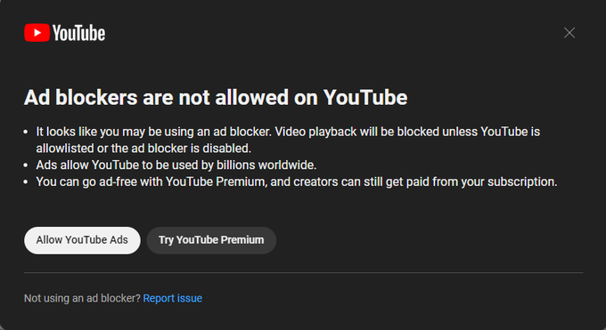

# Extension de Suppression de la Popup YouTube par Tai Tetsuyuki

## Description
L'Extension de Suppression de la Popup YouTube, développée par Tai Tetsuyuki, est conçue pour améliorer votre expérience de navigation sur YouTube. Elle vous permet de supprimer ces agaçantes popups YouTube qui apparaissent chaque fois que vous ouvrez une vidéo. Grâce à cette extension, la musique que vous écoutez se lancera automatiquement, sans interruption, comme vous le souhaitez.

## Installation

1. Téléchargez la dernière version de l'extension depuis [ce lien](https://github.com/LeGitHubDeTai/RemoveYoutubePopupAD/releases/tag/v1.0).

2. Extrayez le contenu du fichier ZIP téléchargé dans un répertoire de votre choix sur votre ordinateur.

3. Ouvrez Google Chrome.

4. Allez dans le menu en haut à droite (trois points verticaux) et sélectionnez "Plus d'outils" > "Extensions" ou entrez `chrome://extensions/` dans la barre d'adresse.

5. Activez le mode "Développeur" en haut à droite de la page.

6. Cliquez sur "Charger l'extension non empaquetée" et sélectionnez le répertoire où vous avez extrait les fichiers de l'extension.

7. L'extension de Suppression de la Popup YouTube par Tai Tetsuyuki devrait maintenant apparaître dans la liste des extensions installées.

8. Assurez-vous que l'extension est activée en bas de la page "Extensions".

## Utilisation

Une fois l'extension installée, elle fonctionnera automatiquement. Lorsque vous ouvrez une vidéo YouTube, la popup sera supprimée, et la musique se lancera automatiquement, améliorant ainsi votre expérience de navigation.

## Remarques

- L'extension de Suppression de la Popup YouTube par Tai Tetsuyuki est une extension non officielle et n'est pas affiliée à Google ou à YouTube.

- L'auteur, Tai Tetsuyuki, n'est pas responsable des éventuels problèmes ou préoccupations liés à l'utilisation de cette extension.

- L'extension peut nécessiter des mises à jour futures pour rester compatible avec les changements de YouTube.

- Veuillez utiliser cette extension de manière responsable et en conformité avec les lois en vigueur dans votre région.

Profitez de votre expérience de navigation sans popups YouTube gênantes grâce à cette extension pratique !
